<!--
  To add the ASCII portrait:
    1. python scripts/prep_photo.py your-photo.jpg
    2. python scripts/make_ascii_svg.py   (writes avi-ascii.svg -- rename as desired)
    3. Swap the whoami section below for the two-column <table> layout
       (portrait + info card side by side), matching the heatmap width
       to the sum of the two column widths.
-->

<h3><code>zohaib@github ~ $ ./contributions.sh</code></h3>

  

<h3><code>zohaib@github ~ $ whoami</code></h3>

  

<h3><code>zohaib@github ~ $ ./links.sh</code></h3>

